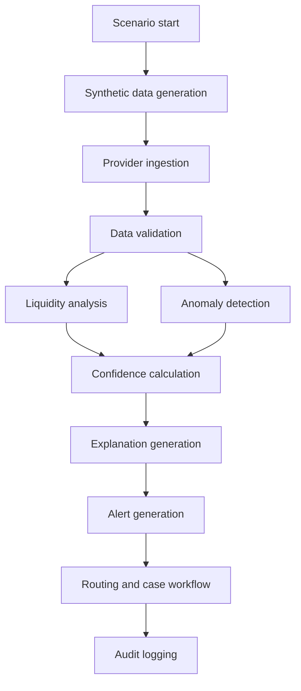
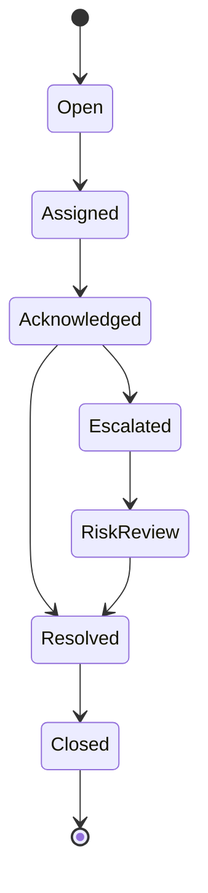
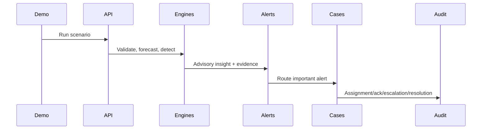
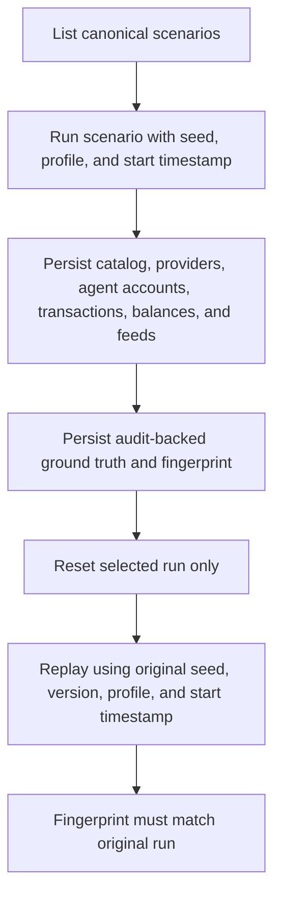
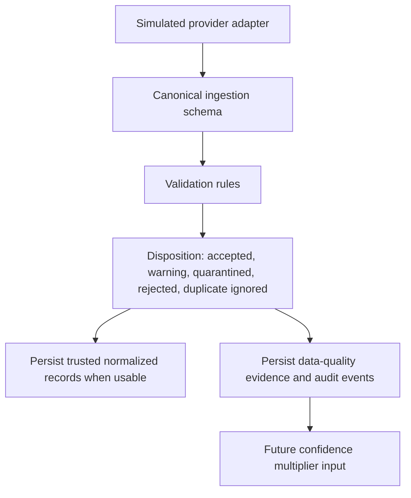
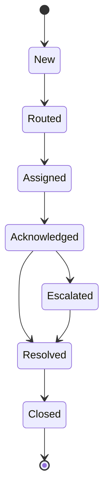

# Workflows

## Flow Overview

## Case State Diagram

## Sequence Diagram

## Workflow Register
| ID | Actor | Trigger | Preconditions | Input | Processing | Decision Points | Output | Failure Path | Safe Fallback | Authorization Boundary | Audit Events | Linked IDs |
|---|---|---|---|---|---|---|---|---|---|---|---|---|
| WF-001 Scenario start | Demo operator | Start selected scenario | Scenario exists | scenario_id | Create scenario run | Valid scenario? | run_id | unknown scenario | reject | demo role | scenario_started | DEMO-001 |
| WF-002 Synthetic data generation | System | Scenario starts | seed exists | seed | Generate providers, cash, balances, transactions | deterministic? | fixture data | bad seed | abort | system | data_generated | DATA-001 |
| WF-003 Provider ingestion | System | Data generated | provider adapters configured | provider feeds | Ingest provider-scoped data | feed present? | feed status | missing feed | mark missing | provider adapter | feed_ingested | FAIL-001 |
| WF-004 Data validation | System | Feed ingested | schema known | records | Validate types, amounts, timestamps | valid? | accepted/rejected | invalid records | data quality event | service | data_validated | NFR-003 |
| WF-005 Liquidity analysis | System | Valid data | balances available | cash, balances, tx | Compute runway | provider or cash shortage? | forecasts | insufficient data | lower confidence | read-only | forecast_created | FR-004 |
| WF-006 Anomaly detection | System | Transactions available | rule version active | tx window | Apply one primary pattern | flagged? | finding | baseline missing | lower confidence | read-only | finding_created | FR-005 |
| WF-007 Confidence calculation | System | Forecast/finding exists | quality status known | signals | Fuse data-quality and rule confidence | high/med/low? | confidence | conflicting data | degrade | advisory only | confidence_recorded | NFR-003 |
| WF-008 Explanation generation | System | Alert candidate | templates exist | structured evidence | Use LLM provider if enabled | valid output? | explanation | LLM fail | deterministic template | no decisioning | explanation_recorded | FR-010 |
| WF-009 Deterministic fallback | System | LLM fails | template exists | evidence | Render template | language? | fallback text | missing template | safe English fallback | no decisioning | fallback_used | FR-011 |
| WF-010 Alert generation | System | Threshold met | evidence exists | insight | Compose alert | important? | alert | unsafe wording | block text | provider scoped | alert_created | FR-007 |
| WF-011 Alert routing | System | Important alert | roles configured | provider, area, severity | Select receiver | owner found? | routed alert | no owner | ops queue | RBAC | alert_routed | FR-008 |
| WF-012 Assignment | Operations | Routed alert | authorized user | owner, version | Assign case | version match? | assigned case | conflict | 409 refresh | provider scoped | case_assigned | FR-008 |
| WF-013 Acknowledgement | Owner | Case assigned | owner exists | idempotency key | Record ack | duplicate? | acknowledged | duplicate action | idempotent result | owner/supervisor | case_acknowledged | FR-008 |
| WF-014 Escalation | Owner | Needs review | case open | target, reason | Escalate | valid target? | escalation | invalid target | keep owner | provider path | case_escalated | FR-008 |
| WF-015 Risk review | Risk reviewer | Escalated case | authorized reviewer | evidence | Review evidence | enough evidence? | review note | insufficient | request info | risk role | risk_reviewed | SAFE-002 |
| WF-016 Resolution | Owner/reviewer | Review complete | case open | status, rationale | Resolve | valid status? | resolved | missing rationale | reject | provider scoped | case_resolved | FR-008 |
| WF-017 Closure | Operations | Resolution accepted | resolved case | case_id | Close | reopen? | closed | concurrent update | 409 refresh | provider scoped | case_closed | FR-008 |
| WF-018 Audit logging | System | Any important action | action context | event | Append audit | append ok? | audit event | write fail | retry/log | system | audit_appended | NFR-002 |
| WF-019 Missing feed | System | Feed absent | expected provider | provider_id | Mark missing | can forecast? | degraded status | no data | no confident forecast | provider scoped | missing_feed | FAIL-001 |
| WF-020 Stale feed | System | Old timestamp | timestamp exists | observed_at | Mark stale | tolerance exceeded? | degraded status | stale | lower confidence | provider scoped | stale_feed | FAIL-002 |
| WF-021 Conflicting balance | System | Mismatch found | snapshots exist | balances | Compare | conflict? | quality event | conflict | no confident conclusion | provider scoped | balance_conflict | FAIL-003 |
| WF-022 Duplicate event | System | Replayed event | event key exists | event | Deduplicate | same payload? | ignored/rejected | conflict | idempotent handling | system | duplicate_event | FAIL-004 |
| WF-023 Concurrent case update | Case user | Two writes | version known | If-Match | Optimistic concurrency | mismatch? | update or 409 | lost update risk | refresh | actor scope | concurrency_conflict | FAIL-005 |
| WF-024 Unauthorized provider access | Any user | Scoped request | scopes known | provider_id | Check scope | allowed? | data or 403 | cross-provider | deny | API/service/query/UI | access_denied | FAIL-006 |
| WF-025 Demo reset | Demo operator | Reset requested | run exists | run_id | Reset scenario state | valid run? | clean state | missing run | abort | demo role | scenario_reset | DEMO-002 |
| WF-026 Demo replay | Demo operator | Replay requested | seed exists | run_id | Replay same seed | deterministic? | repeated output | missing seed | abort | demo role | scenario_replayed | DEMO-002 |

## Implemented Scenario CLI Workflow
The scenario engine is internal developer/demo tooling. It does not expose public scenario APIs yet.

Accounting convention:
- Cash-in increases shared physical cash and decreases the provider-specific e-money balance.
- Cash-out decreases shared physical cash and increases the provider-specific e-money balance.
- Shared physical cash is outlet scoped and never satisfies a provider-specific e-money balance.
- Missing provider balance is stored as unknown/null, not zero.

## Implemented Validation Workflow
Provider ingestion and validation are internal-only service workflows. They normalize simulated provider records into canonical transaction, provider-balance, shared-cash, and feed-status inputs before later analytics modules consume them.

Validation does not forecast liquidity, detect anomalies, create alerts, open cases, or make operational decisions.

## Alert And Case Lifecycle Separation
Alerts and cases are separate entities. An alert can exist without a case when severity is low or confidence is insufficient for coordinated review.

Alert statuses:

Case creation rule: create a case when alert severity is `high`, or when severity is `medium` and confidence score is at least `0.50`. Low-severity alerts remain alert-only unless a manager manually promotes them during the demo. Case lifecycle remains `Open -> Assigned -> Acknowledged -> Escalated/RiskReview -> Resolved -> Closed` and must reference the source alert.
