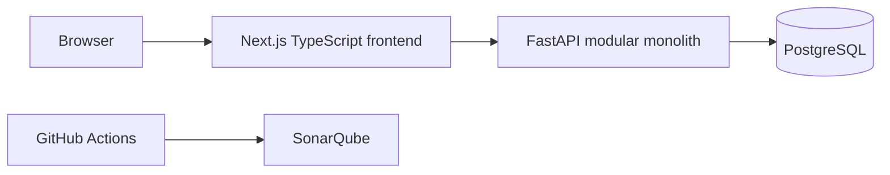
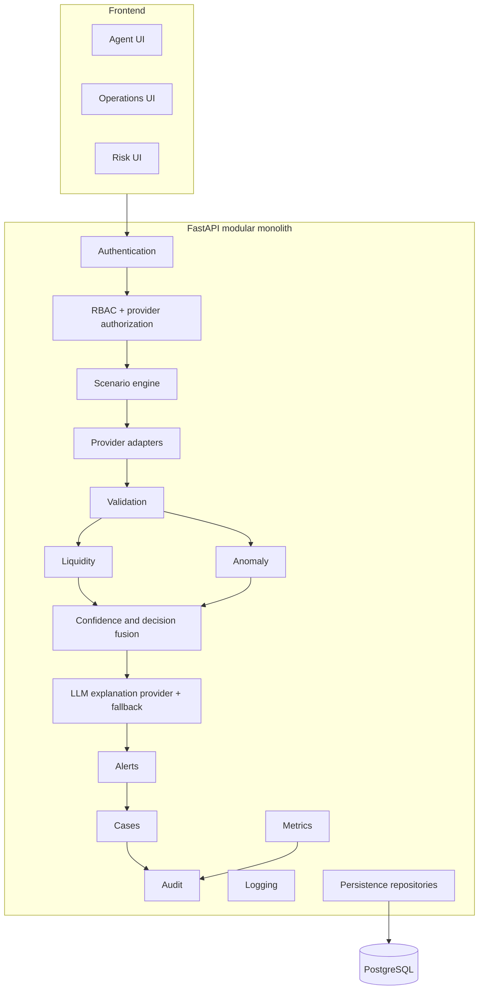
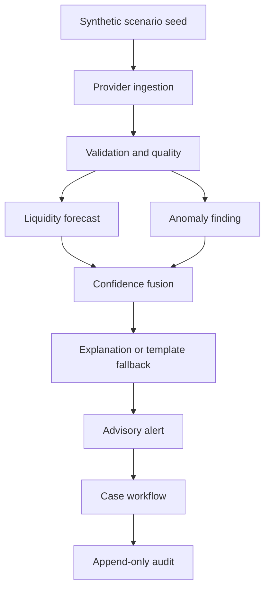
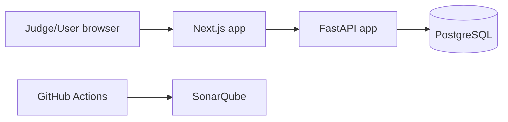
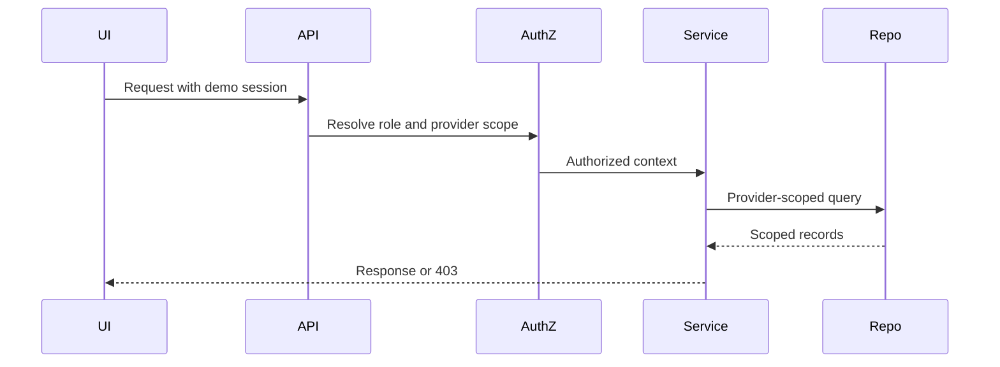
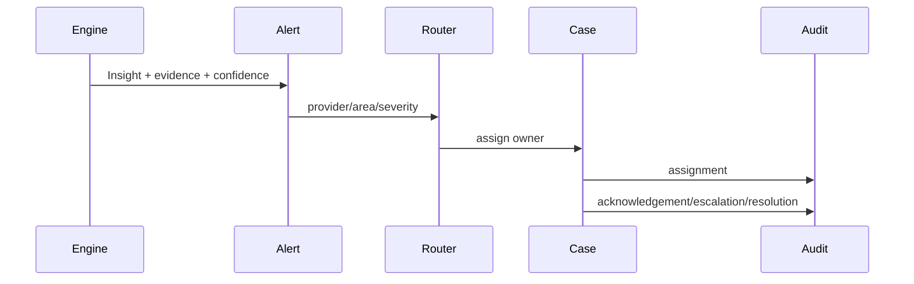

# Architecture

## Decision
Use a modular monolith. Microservices, Kafka, Redis/Upstash, separate provider deployments, and mandatory WebSockets are deferred.

## Package Layout
```text
backend/
  app/
    core/
    auth/
    providers/
    scenarios/
    validation/
    liquidity/
    anomaly/
    confidence/
    explanations/
    alerts/
    cases/
    audit/
    metrics/
    api/
    persistence/

frontend/
  src/
    app/
    features/
    components/
    lib/
    types/
```

## Dependency Rules
- API may call application services.
- Application services may call domain logic and repository interfaces.
- Domain logic must not depend on FastAPI, SQLAlchemy, or LLM vendors.
- Persistence implementations may depend on SQLAlchemy.
- UI must not implement financial decision logic.
- Explanation provider must not create or modify core risk decisions.
- Provider-scoped queries must receive an authorization context.

## Transaction Boundaries
| Service | Transaction Owner |
|---|---|
| Scenario execution | Scenario service owns scenario_run, generated synthetic records, and reset/replay state. |
| Alert creation | Alert service owns alert, evidence links, confidence snapshot, explanation record, and audit event. |
| Assignment | Case service owns assignment update, version increment, and audit event. |
| Acknowledgement | Case service owns idempotency check, acknowledgement event, version increment, and audit event. |
| Escalation | Case service owns escalation record, owner/status update, version increment, and audit event. |
| Case resolution | Case service owns final status, rationale, history event, version increment, and audit event. |
| Audit event creation | Audit service appends events in the same transaction as the triggering state change where possible. |

## Concurrency Policy
- Mutating case and alert actions require an idempotency key.
- Cases carry optimistic concurrency/version fields.
- Duplicate acknowledgement returns the existing acknowledgement result without appending duplicate history.
- Concurrent assignment with a stale version returns conflict and requires refresh.
- Case notes, status history, escalations, and audit events are append-only.

## Sync/Async Policy
- Core MVP request processing may be synchronous.
- Long scenario generation or explanation may use a simple in-process background task only if necessary.
- No Kafka, distributed queue, or mandatory WebSocket architecture for MVP.
- Explanation timeout or malformed output must use deterministic fallback.

## Domain Event Policy
Initial domain events are in-process records:
- FeedValidated
- LiquidityForecastCreated
- AnomalyFindingCreated
- AlertCreated
- AlertAcknowledged
- CaseEscalated
- CaseResolved

## High-Level Diagram


## Component Diagram


## Data Flow


## Deployment Diagram


## Authorization Flow


## Alert/Case Sequence


## Provider Isolation Enforcement
| Layer | Enforcement |
|---|---|
| API | Validate provider_id against user scope; return 403 on mismatch. |
| Service | Require authorized context for every provider-scoped operation. |
| Repository/query | Always filter by provider_id or parent provider scope. |
| UI | Hide out-of-scope provider records and actions; never rely on UI alone. |

## Safe LLM Boundary
The LLM explanation provider is vendor-neutral and cannot make core decisions. Deterministic rules produce forecasts/findings; deterministic templates handle LLM failure.
