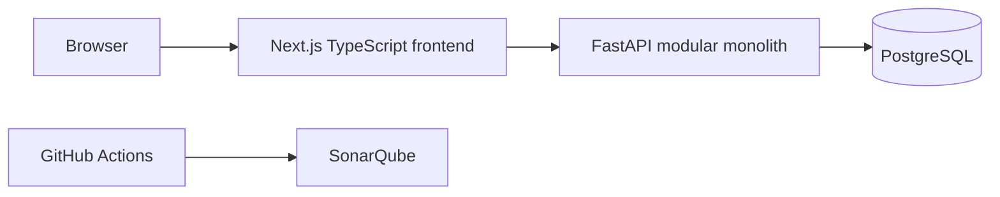
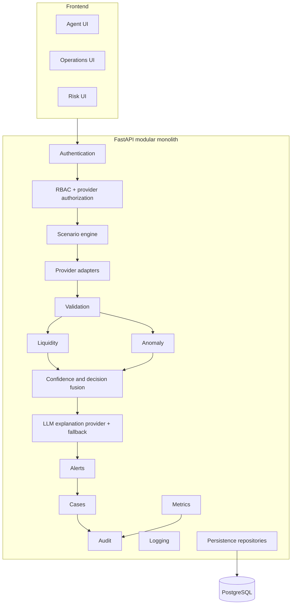
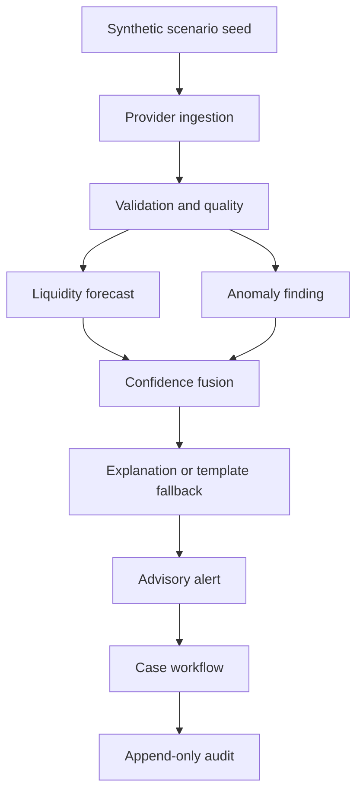
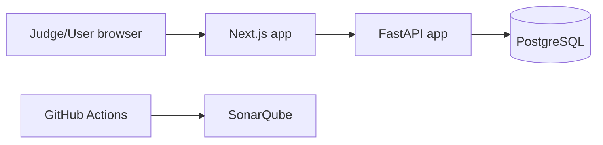
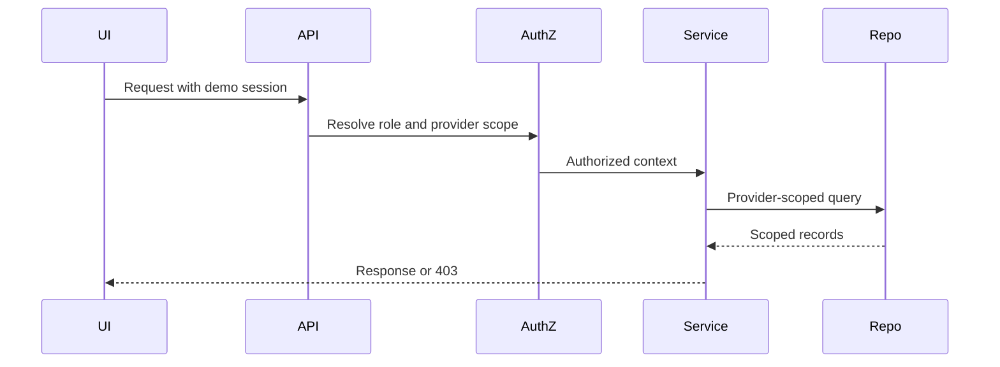
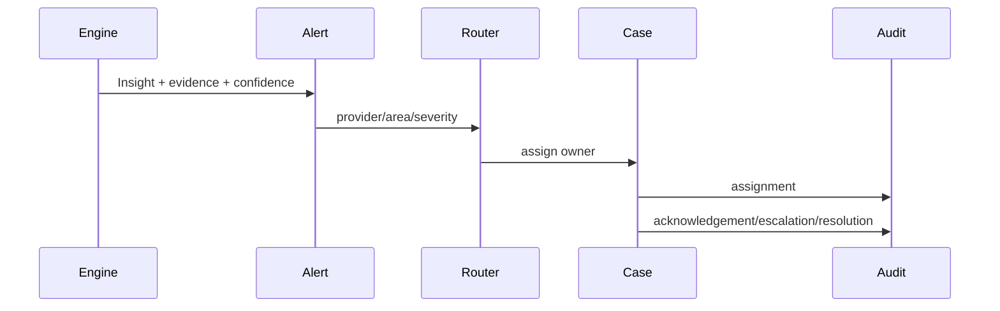

# Architecture

## Decision
Use a modular monolith. Microservices, Kafka, Redis/Upstash, separate provider deployments, and mandatory WebSockets are deferred.

## High-Level Diagram

## Component Diagram

## Data Flow

## Deployment Diagram

## Authorization Flow

## Alert/Case Sequence

## Provider Isolation Enforcement
| Layer | Enforcement |
|---|---|
| API | Validate provider_id against user scope; return 403 on mismatch. |
| Service | Require authorized context for every provider-scoped operation. |
| Repository/query | Always filter by provider_id or parent provider scope. |
| UI | Hide out-of-scope provider records and actions; never rely on UI alone. |

## Safe LLM Boundary
The LLM explanation provider is vendor-neutral and cannot make core decisions. Deterministic rules produce forecasts/findings; deterministic templates handle LLM failure.
