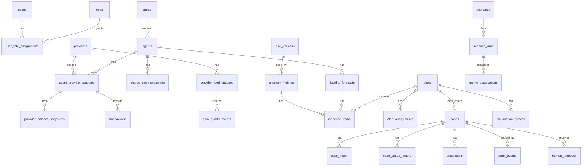

# PostgreSQL Database Design

SQLAlchemy ORM models and the initial Alembic domain schema migration are implemented for the MVP table registry. Alembic remains the authoritative schema creation path; the application runtime must not call `metadata.create_all()`.

## Implementation Notes
- Monetary values use PostgreSQL-compatible `NUMERIC(14,2)` for cash, balances, and transactions; confidence values use `NUMERIC(5,4)` for `0..1` ranges.
- Timestamp columns use timezone-aware `DateTime(timezone=True)` and are intended to store UTC values.
- Shared cash snapshots do not include `provider_id`; provider balance snapshots are scoped to one agent/provider account and include composite foreign keys to prevent cross-provider mismatch.
- Nullable balance amounts represent unknown or missing data. Unknown balances must not default to zero.
- Public-facing identifiers use deterministic synthetic references such as `SIM-AGENT-0001`, `SIM-CUST-0001`, and `SIM-TXN-000001`.
- Append-only history/audit tables avoid delete-orphan cascades.

## Composite Index Rationale
- `ix_transactions_agent_occurred`: supports agent timeline and evidence review.
- `ix_transactions_provider_occurred`: supports provider-scoped anomaly windows.
- `ix_transactions_account_occurred`: supports synthetic account velocity checks.
- `ix_provider_balance_agent_provider_observed`: supports provider runway queries by outlet and time.
- `ix_shared_cash_agent_observed`: supports shared-cash runway queries by outlet and time.
- `ix_feed_provider_agent_observed`: supports feed quality inspection by provider/outlet/time.
- `ix_alerts_status_priority_owner_provider_created`: supports alert queues by lifecycle, urgency, owner, and provider.
- `ix_cases_status_owner_provider_updated`: supports case work queues and stale case review.
- `ix_audit_entity_created`: supports audit trace lookup for a specific entity.
- `ix_scenario_runs_scenario_status_started`: supports scenario run replay/status listing.
- `ix_anomaly_agent_provider_detected`: supports anomaly review by outlet/provider/time.
- `ix_forecasts_agent_provider_time`: supports forecast history by outlet/provider/time.

## ER Diagram

## Table Registry
| Table | Purpose | Columns (PostgreSQL types) | PK | FK | Constraints | Indexes | Relationships | Provider Scope | Retention |
|---|---|---|---|---|---|---|---|---|---|
| users | Demo actors | id uuid, display_name text, email text, created_at timestamptz | id | none | email must not be real customer data | email | roles/audit | mixed | demo lifecycle |
| roles | Role catalog | id uuid, name text | id | none | name in agent,ops,field,risk,manager,demo | name | assignments | none | long-lived |
| user_role_assignments | RBAC scopes | id uuid, user_id uuid, role_id uuid, provider_id uuid null, area_id uuid null | id | users, roles, providers, areas | scoped uniqueness | user_id,provider_id | users/providers | optional provider | demo lifecycle |
| providers | Simulated providers | id uuid, code text, display_name text, boundary_note text | id | none | code unique | code | accounts/feed | root provider | long-lived |
| areas | Areas | id uuid, code text, display_name text | id | none | code unique | code | agents | none | long-lived |
| agents | Outlets | id uuid, area_id uuid, display_code text, status text | id | areas | status valid | area_id | accounts/cash | none | demo lifecycle |
| agent_provider_accounts | Provider account at outlet | id uuid, agent_id uuid, provider_id uuid, synthetic_ref text, status text | id | agents,providers | unique agent/provider; synthetic_ref not phone-like | provider_id,agent_id | balances/tx | provider_id | demo lifecycle |
| shared_cash_snapshots | Shared cash, not provider feed | id uuid, agent_id uuid, amount numeric(14,2), observed_at timestamptz, scenario_run_id uuid | id | agents,scenario_runs | amount >= 0 | agent_id,observed_at | forecasts | none | scenario retention |
| provider_balance_snapshots | Provider e-money | id uuid, account_id uuid, amount numeric(14,2), observed_at timestamptz, quality_status text | id | agent_provider_accounts | amount >= 0 | account_id,observed_at | forecasts | via account | scenario retention |
| transactions | Synthetic tx | id uuid, account_id uuid, synthetic_customer_ref text, type text, amount numeric(14,2), status text, occurred_at timestamptz | id | agent_provider_accounts | amount >= 0; synthetic ref not phone-like | account_id,occurred_at | findings | via account | scenario retention |
| provider_feed_statuses | Feed quality | id uuid, provider_id uuid, scenario_run_id uuid, status text, observed_at timestamptz, ingested_at timestamptz | id | providers,scenario_runs | status valid | provider_id,status | quality events | provider_id | scenario retention |
| data_quality_events | Data issues | id uuid, feed_status_id uuid, event_type text, severity text, details jsonb, created_at timestamptz | id | provider_feed_statuses | severity valid | event_type | evidence/alerts | via feed | scenario retention |
| liquidity_forecasts | Runway forecasts | id uuid, agent_id uuid, provider_id uuid null, forecast_type text, shortage_at timestamptz null, confidence numeric(5,4) | id | agents,providers | confidence 0..1 | agent_id,provider_id | evidence | provider optional | scenario retention |
| anomaly_findings | Rule findings | id uuid, provider_id uuid, agent_id uuid, rule_version_id uuid, severity text, score numeric(10,4), created_at timestamptz | id | providers,agents,rule_versions | score >= 0 | provider_id,agent_id | evidence | provider_id | scenario retention |
| evidence_items | Evidence fingerprint | id uuid, alert_id uuid null, forecast_id uuid null, finding_id uuid null, evidence_type text, payload jsonb | id | alerts,forecasts,findings | at least one parent | alert_id | alerts/findings | inherited | scenario retention |
| confidence_assessments | Confidence reasons | id uuid, subject_type text, subject_id uuid, confidence numeric(5,4), reasons jsonb | id | none | confidence 0..1 | subject_type,subject_id | alerts | inherited | scenario retention |
| explanation_records | LLM/template output | id uuid, alert_id uuid, language text, provider text, text text, fallback_used boolean | id | alerts | language valid | alert_id | alerts | inherited | scenario retention |
| alerts | Advisory alerts | id uuid, provider_id uuid null, agent_id uuid, type text, severity text, status text, summary text, created_at timestamptz | id | providers,agents | status valid | provider_id,status | cases/evidence | provider optional | scenario retention |
| alert_assignments | Assignment history | id uuid, alert_id uuid, assigned_to_user_id uuid, assigned_by_user_id uuid, created_at timestamptz | id | alerts,users | none | alert_id | alerts | inherited | scenario retention |
| cases | Important case | id uuid, origin_alert_id uuid null unique, provider_id uuid null, agent_id uuid, status text, version integer | id | alerts,providers,agents | version >= 1 | provider_id,status | notes/history | provider optional | scenario retention |
| case_notes | Notes | id uuid, case_id uuid, author_user_id uuid, note text, created_at timestamptz | id | cases,users | note not empty | case_id | cases | inherited | scenario retention |
| case_status_history | Status audit | id uuid, case_id uuid, from_status text, to_status text, actor_user_id uuid, reason text, created_at timestamptz | id | cases,users | to_status valid | case_id,created_at | cases | inherited | append-only |
| escalations | Escalation audit | id uuid, case_id uuid, from_role text, to_role text, reason text, created_at timestamptz | id | cases | reason not empty | case_id | cases | inherited | append-only |
| audit_events | Append-only audit | id uuid, actor_user_id uuid null, provider_id uuid null, event_type text, entity_type text, entity_id uuid, payload jsonb, created_at timestamptz | id | users,providers | event_type not empty | provider_id,event_type | all | provider optional | append-only |
| scenarios | Scenario catalog | id uuid, code text, name text, description text | id | none | code unique | code | runs | none | long-lived |
| scenario_runs | Scenario executions | id uuid, scenario_id uuid, seed text, status text, started_at timestamptz, ended_at timestamptz null | id | scenarios | status valid | scenario_id,status | metrics/data | none | scenario retention |
| rule_versions | Rule config | id uuid, name text, version text, config jsonb, active boolean | id | none | unique name/version | name,active | findings | none | long-lived |
| human_feedback | Review feedback | id uuid, case_id uuid, user_id uuid, feedback_type text, details jsonb, created_at timestamptz | id | cases,users | feedback_type not empty | case_id | cases | inherited | scenario retention |
| metric_observations | Metrics | id uuid, scenario_run_id uuid, metric_id text, value numeric(14,4), threshold numeric(14,4), passed boolean | id | scenario_runs | metric_id like MET-% | metric_id | scenarios | none | demo retention |

## Cardinality Rules
An alert may exist without a case. A case may originate from one important alert. Case history and audit events are append-only.
