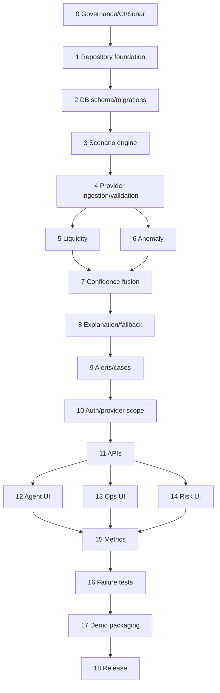

# Implementation Plan

| Phase | Module | Status |
|---|---|---|
| 0 | Governance, prompt validation, CI, SonarQube | Configured |
| 1 | Repository foundation | Implemented |
| 2 | Database schema and migrations | Verified locally |
| 3 | Synthetic scenario engine | Implemented |
| 4 | Provider ingestion and validation | Implemented |
| 5 | Liquidity engine | Not Started |
| 6 | Anomaly engine | Not Started |
| 7 | Confidence and decision fusion | Not Started |
| 8 | Explanation service and fallback | Not Started |
| 9 | Alerts and cases | Not Started |
| 10 | Authentication and provider-scope authorization | Not Started |
| 11 | Backend APIs | Not Started |
| 12 | Agent UI | Implemented with demo fixtures; API integration pending |
| 13 | Operations UI | Implemented with demo fixtures; API integration pending |
| 14 | Risk UI | Implemented with demo fixtures; API integration pending |
| 15 | Metrics and observability | Frontend surface implemented; backend pending |
| 16 | Integration and failure testing | Frontend verified; backend pending |
| 17 | Demo packaging | Not Started |
| 18 | Release preparation | Not Started |

