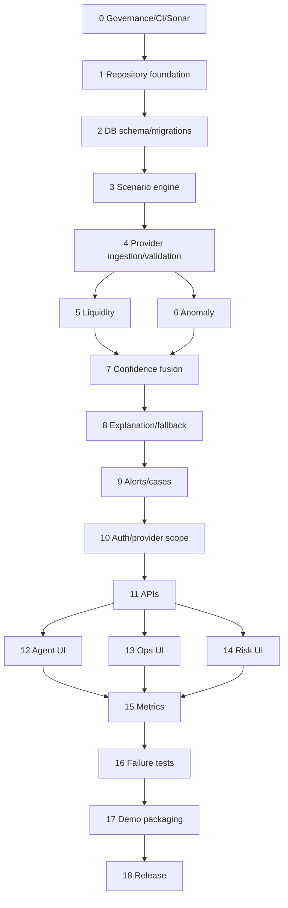

# Implementation Plan

| Phase | Module | Status |
|---|---|---|
| 0 | Governance, prompt validation, CI, SonarQube | Configured |
| 1 | Repository foundation | Implemented |
| 2 | Database schema and migrations | Implemented |
| 3 | Synthetic scenario engine | Pending |
| 4 | Provider ingestion and validation | Pending |
| 5 | Liquidity engine | Pending |
| 6 | Anomaly engine | Pending |
| 7 | Confidence and decision fusion | Pending |
| 8 | Explanation service and fallback | Pending |
| 9 | Alerts and cases | Pending |
| 10 | Authentication and provider-scope authorization | Pending |
| 11 | Backend APIs | Pending |
| 12 | Agent UI | Pending |
| 13 | Operations UI | Pending |
| 14 | Risk UI | Pending |
| 15 | Metrics and observability | Pending |
| 16 | Integration and failure testing | Pending |
| 17 | Demo packaging | Pending |
| 18 | Release preparation | Pending |

