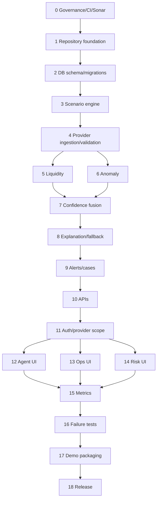

# Implementation Plan

| Phase | Module |
|---|---|
| 0 | Governance, prompt validation, CI, SonarQube |
| 1 | Repository foundation |
| 2 | Database schema and migrations |
| 3 | Synthetic scenario engine |
| 4 | Provider ingestion and validation |
| 5 | Liquidity engine |
| 6 | Anomaly engine |
| 7 | Confidence and decision fusion |
| 8 | Explanation service and fallback |
| 9 | Alerts and cases |
| 10 | Backend APIs |
| 11 | Authentication and provider-scope authorization |
| 12 | Agent UI |
| 13 | Operations UI |
| 14 | Risk UI |
| 15 | Metrics and observability |
| 16 | Integration and failure testing |
| 17 | Demo packaging |
| 18 | Release preparation |

